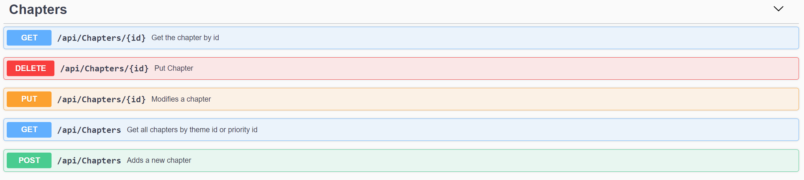
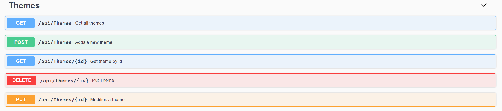
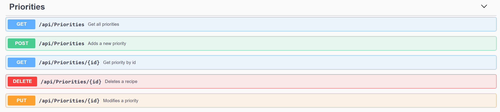
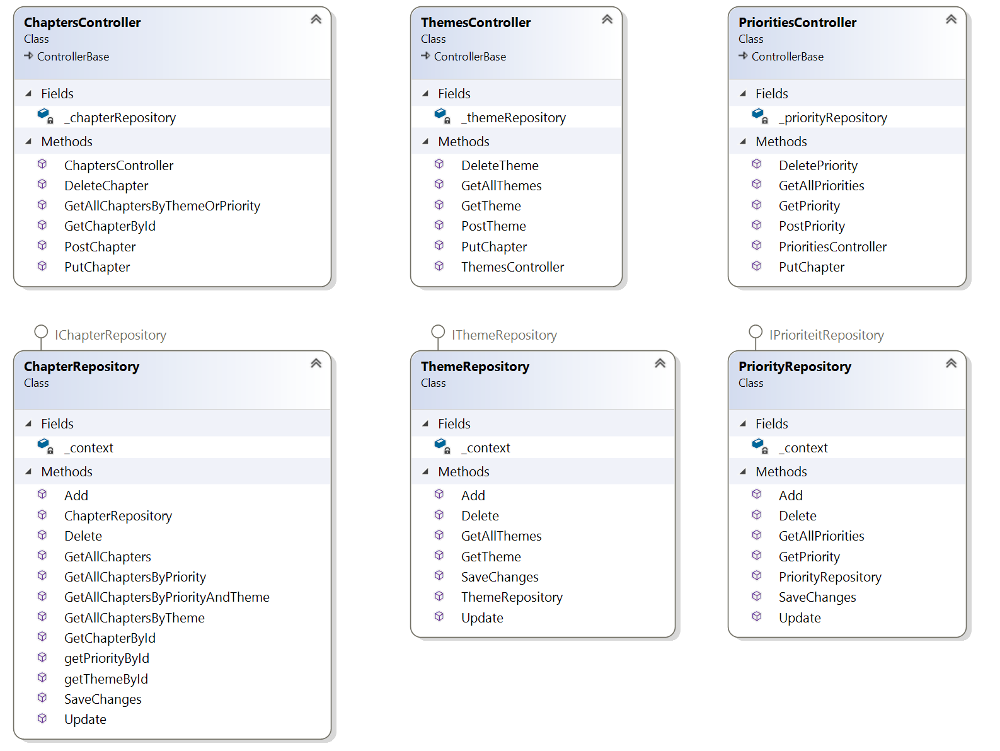
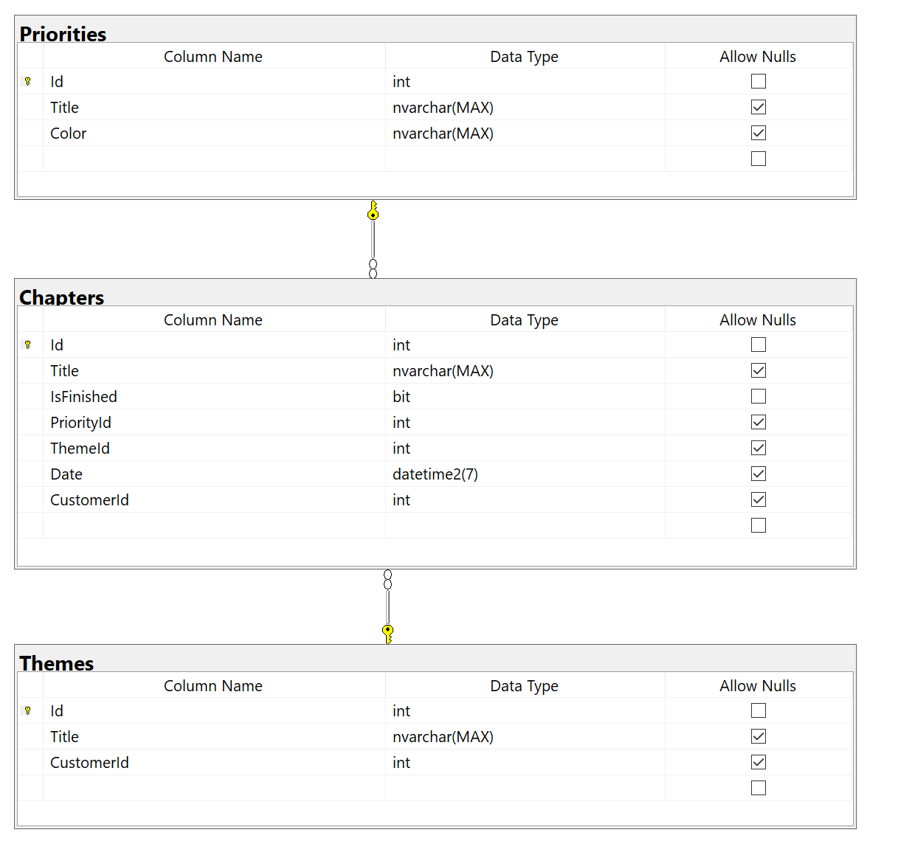

# 2021-TILE-BE-WA4-Ilya_Mikhaylov

De backend voor chapters to-do app.

De api staan niet online, deze moet je offline opgestart te worden.

### Installing

* Clone the repository:
```
git clone https://github.com/pl77711/2021-be-ilyamikh.git
```

* Navigate to the project:
```
cd 2021-be-ilyamikh
```

* Run the project:
```
dotnet run
```

### Printscreens Swagger
* Chapters controller


* Themes controller


* Priorities controller (wordt niet gebruikt in de front end)


* Algemene classendiagram


* Database diagram



